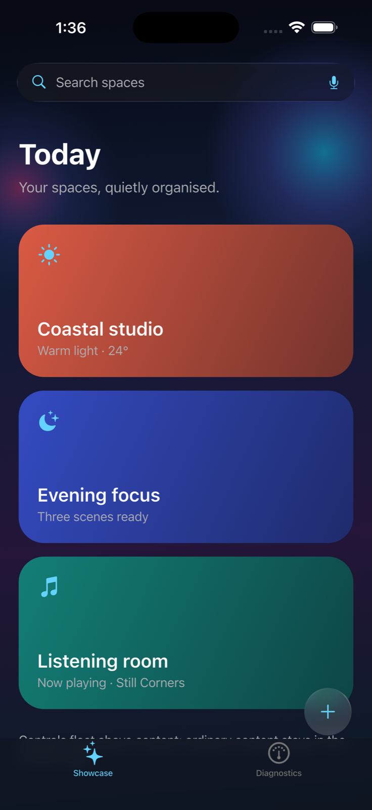

<p align="center">
  
</p>

# Vitreum example

The example application demonstrates Vitreum over a moving, colorful background
so blur quality, contrast, and fallback behavior remain visible.



> This is an actual iOS 26.5 simulator capture using one scoped native search
> overlay; other Vitreum surfaces use the portable renderer.
> Appearance varies with the content behind the surface and accessibility
> settings.

## Included demonstrations

- A Cupertino showcase with floating search and navigation controls
- Edge-to-edge moving content beneath the control layer
- A separate diagnostics tab with exact backend capability fields
- Pure-native, native-over-Flutter, and simulated comparison scenes
- A configurable simulated-renderer stress test

Launch a diagnostic directly:

```sh
flutter run --dart-define=VITREUM_DIAGNOSTIC_SCENE=pure
flutter run --dart-define=VITREUM_DIAGNOSTIC_SCENE=native_flutter
flutter run --dart-define=VITREUM_DIAGNOSTIC_SCENE=simulated
```

## Run

From the example directory:

```sh
flutter pub get
flutter run
```

For meaningful performance inspection:

```sh
flutter run --profile
```

## Profiling checklist

Record the following with Flutter DevTools:

- Device or emulator model
- OS and Flutter versions
- Active renderer
- Surface count and dimensions
- Quality selection
- Average and worst build time
- Average and worst raster time

Do not compare performance while connected through debug mode.
